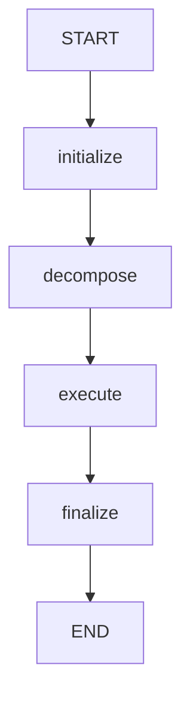
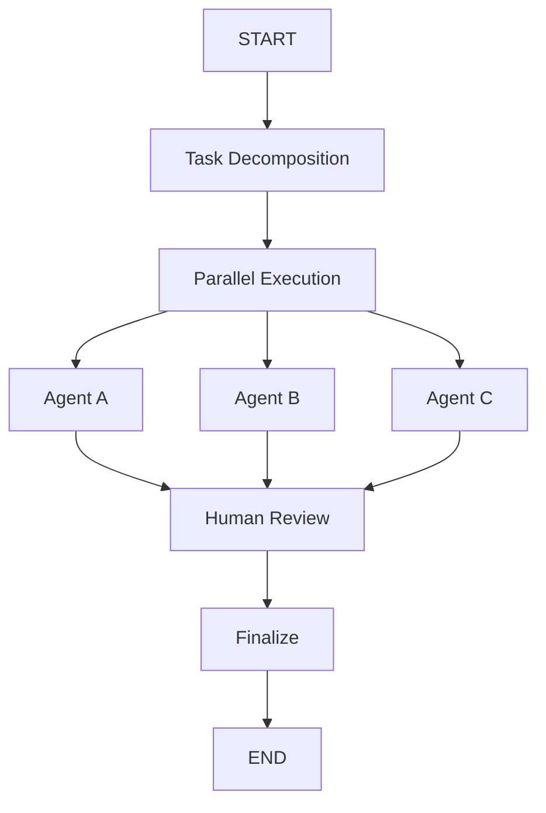

# LangGraph Orchestration Migration Guide

## Overview

Harness-Engineering CLI now supports LangGraph-based orchestration for advanced agent workflows. This guide helps you understand the new features and migrate from the legacy execution model.

## Features

### 🔄 Human-in-the-Loop Review
Enable human review before critical operations like PR creation or major code changes. Configure timeout and auto-approval behavior.

### ⚡ Parallel Agent Execution
Run multiple agents simultaneously to speed up task execution. Control the maximum parallelism to balance performance and resource usage.

### 🧪 A/B Testing
Compare different agent strategies by enabling A/B testing. The system can automatically evaluate and select the better performing approach.

### 📊 Architecture Visualization
Generate Mermaid diagrams of your agent workflow architecture for documentation and debugging.

## Configuration Options

| Option | Type | Default | Description |
|--------|------|---------|-------------|
| `enableHumanReview` | boolean | `false` | Enable human review checkpoints |
| `reviewTimeoutMs` | number | `300000` | Timeout for human review (5 min) |
| `autoApproveAfterTimeout` | boolean | `false` | Auto-approve when timeout reached |
| `enableParallelExecution` | boolean | `false` | Enable parallel agent execution |
| `maxParallelAgents` | number | `3` | Maximum parallel agents |
| `enableABTesting` | boolean | `false` | Enable A/B testing for strategies |

## Quick Start

### 1. Add Orchestration Config

Add the following to your `.harness/config.yaml`:

```yaml
orchestration:
  enableHumanReview: true
  reviewTimeoutMs: 300000
  autoApproveAfterTimeout: false
  enableParallelExecution: true
  maxParallelAgents: 3
  enableABTesting: false
```

### 2. Verify Configuration

```bash
harness visualize
```

This will output the architecture diagram of your configured workflow.

### 3. Save Architecture Diagram

```bash
harness visualize -o architecture.mmd
```

## Architecture Diagram Example

When LangGraph is enabled, the following workflow is used:



With parallel execution enabled:



## Backward Compatibility

### Legacy Mode (Default)

Without the `orchestration` section in your config, Harness operates in legacy mode:

```yaml
# No orchestration section = legacy mode
llm:
  provider: openai
  # ...
```

In legacy mode:
- Single-threaded task execution
- No human review checkpoints
- No A/B testing
- Architecture diagram shows legacy flow

### Migration Path

1. **Start with defaults**: Add orchestration config with all features disabled
2. **Enable features gradually**: Turn on features one at a time
3. **Test thoroughly**: Verify each feature works with your workflow
4. **Full migration**: Enable all desired features

Example migration config:

```yaml
# Step 1: Add section (all disabled)
orchestration:
  enableHumanReview: false
  enableParallelExecution: false
  enableABTesting: false

# Step 2: Enable parallel execution
orchestration:
  enableHumanReview: false
  enableParallelExecution: true
  maxParallelAgents: 2
  enableABTesting: false

# Step 3: Add human review
orchestration:
  enableHumanReview: true
  reviewTimeoutMs: 600000
  autoApproveAfterTimeout: true
  enableParallelExecution: true
  maxParallelAgents: 2
  enableABTesting: false
```

## API Reference

### LoopController Methods

#### `getArchitectureDiagram(): Promise<string>`

Returns a Mermaid diagram string representing the current workflow architecture.

```typescript
const controller = new LoopController(config);
const diagram = await controller.getArchitectureDiagram();
console.log(diagram);
```

#### `saveArchitectureDiagram(outputPath: string): Promise<void>`

Saves the architecture diagram to a file.

```typescript
await controller.saveArchitectureDiagram('./diagram.mmd');
```

### CLI Commands

#### `harness visualize`

Generate and display architecture diagram:

```bash
# Display to console
harness visualize

# Save to file
harness visualize -o diagram.mmd

# Use custom config
harness visualize -c custom-config.yaml
```

## Troubleshooting

### Diagram Shows Legacy Flow

If `harness visualize` shows the legacy flow instead of LangGraph flow:

1. Check that `orchestration` section exists in config
2. Verify config file path is correct
3. Ensure config is loaded without errors

### Performance Issues

If parallel execution causes issues:

1. Reduce `maxParallelAgents`
2. Disable parallel execution for specific tasks
3. Monitor system resource usage

### Review Timeouts

If human reviews are timing out:

1. Increase `reviewTimeoutMs`
2. Enable `autoApproveAfterTimeout` for non-critical operations
3. Review notification settings

## See Also

- [SUPERPOWERS_INTEGRATION.md](./SUPERPOWERS_INTEGRATION.md) - Superpowers integration overview
- [Config Example](../../.harness/config.example.yaml) - Full configuration example
